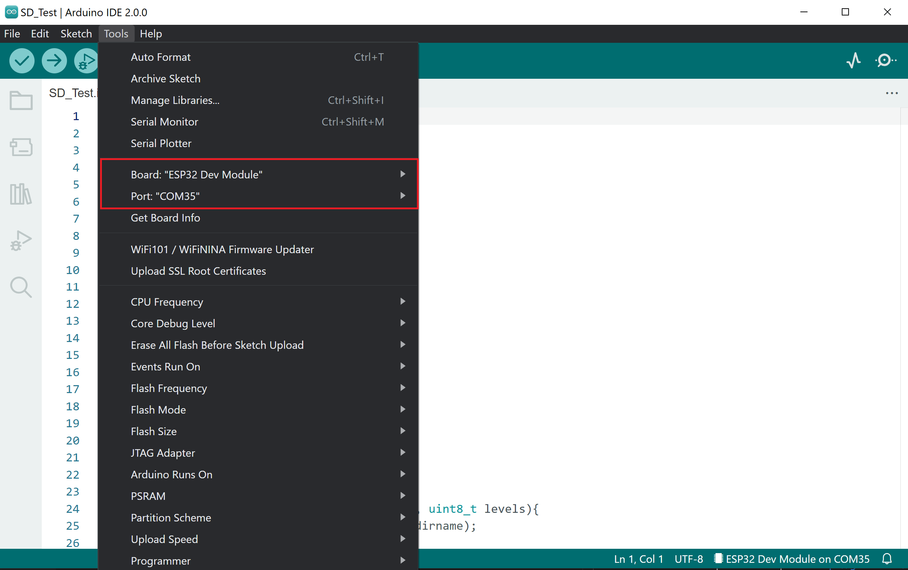

# How to make display work

1. Download [CH341SER.EXE](http://www.wch-ic.com/search?q=CH340&t=downloads) and install it.

2. Connect display to your PC and turn it on with button on the side of the device (**single press to turn on, long press to turn off**).

3. Open Device Manager (Start → Control Panel → Hardware and Sound → Device Manager) and find COM port number.

    

## Arduino IDE
1. Download Github repository and look for project you want to try in [SW](../SW) folder.
2. Open example with Arduino IDE and set appropriate COM port and board type.
   
    

3. Download necessary libraries.
4. You always need to adjust TFT_eSPI library to specific display. We  already prepared configuration file for this display ([Setup300_ILI9488_ESPD-3_5.h](Setup300_ILI9488_ESPD-3_5.h)).
To use it, you need to copy this file to folder with your libraries: Arduino\libraries\TFT_eSPI\User_Setups.
1. In file Arduino\libraries\TFT_eSPI\User_Setup_Select.h you need to add this line: `#include <User_Setups/Setup300_ILI9488_ESPD-3_5.h>` into this section: `#ifndef USER_SETUP_LOADED` and comment `#include <User_Setup.h>` as shown in the picture and save it.
   
   

2. Upload the code.
## Platform IO
1. Download Github repository and look for project you want to try in [SW](https://github.com/LaskaKit/ESPD-35/tree/main/SW) folder.
2. Open example with Platform IO. COM port should be set automaticaly.
3. Libraries will be downloaded automatically, because of lib_deps in platformio.ini.
4. You always need to adjust TFT_eSPI library to specific display. For Platform IO, we can use build flags, so no file editing is necessary. Everything is already set in platformio.ini of every example.
    

    
    

5. Upload the code.